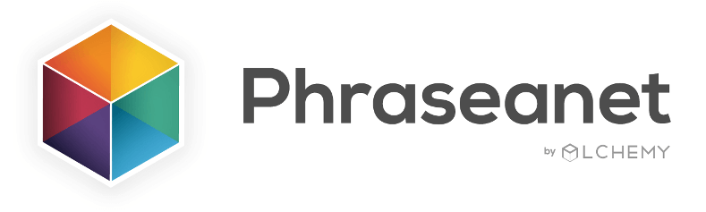
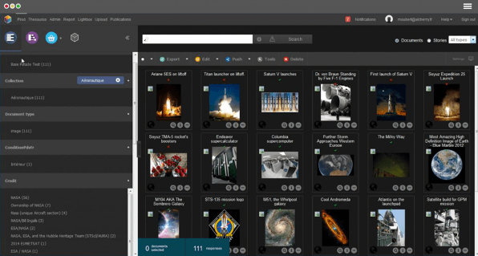

The most complete Open Source Digital Asset Management solution on the market.

## Features

 - Metadata Management (include Thesaurus and DublinCore Mapping)
 - RestFull APIS
 - Elasticsearch search engine
 - Multiple resolution assets generation

## Installation

 - Beginner users
    - [Linux (Ubuntu/Debian)](./doc/installLinux.md)
    - [Linux (other distribution)](./doc/installLinux.md)
    - [MacOs](./doc/installDemo.md)
    - [Windows](./doc/installDemo.md)
    
 - Power users   
 
 - [Developpement mode](./doc/installDev.md)

## Advanced usage

Want to work 

## Documentation

https://docs.phraseanet.com/

For development with Phraseanet API see https://docs.phraseanet.com/4.0/en/Devel/index.html

## License

Phraseanet is licensed under GPL-v3 license.

